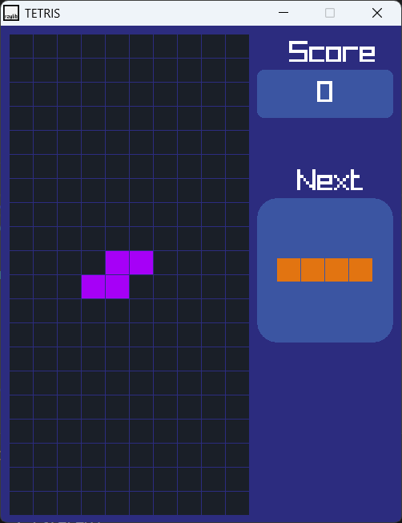
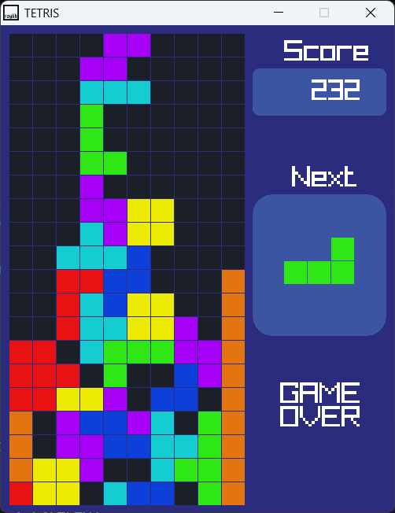

# Tetris Game- C++ using raylib
Tetris game made in C++ using the raylib library.

# How to play the game
1. Press F5 on the keyboard to compile and run the program.
2. Use the "left", "right", and "down" keys to move the blocks
3. Clear rows to increase the score
4. It's "Game Over" when there is no more space for new blocks

# Game Preview

  

# Game Over

  

Made with <a href="https://github.com/educ8s/Raylib-CPP-Starter-Template-for-VSCODE-V2">Raylib Starter Template</a>
